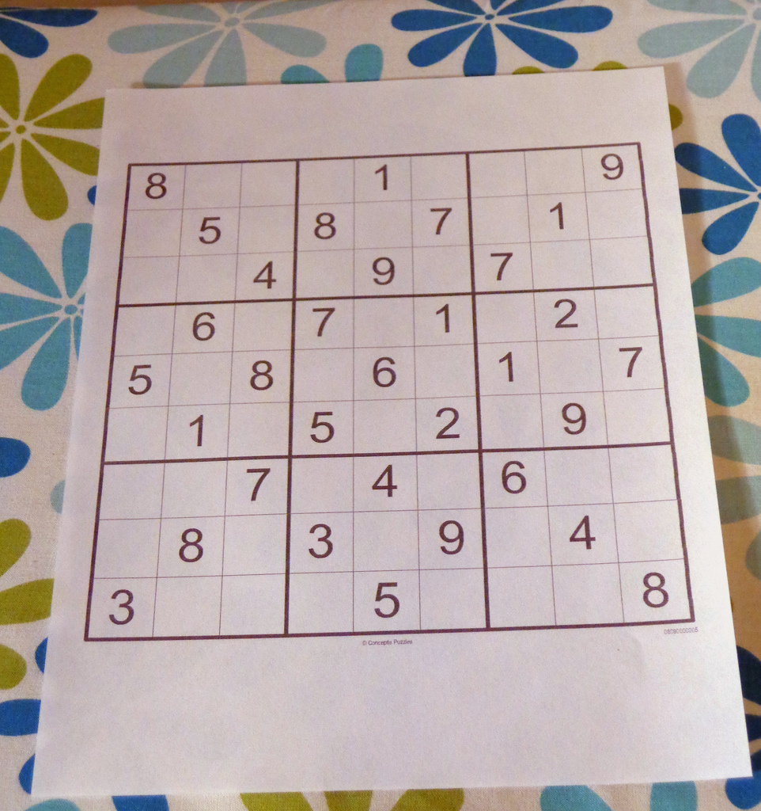

# Sudoku AI Solver

In this project, a Sudoku Artificial Intelligence (AI) puzzle solver is built using python, OpenCV, Deep Learning (DL) and OCR (Optical Character Recognition) methods to solve puzzles obtained from images. The steps required to implement the solver will be outlined after a brief overview of Sudoku puzzles.

(Work in progress)

## Sudoku
Sudoku is logic-based puzzle where the objective is to fill up a 9 x 9 grid with numbers from 1-9 in each row, each column and each mini 3 x 3 grid in such a way that each number does not appear more than once in a row, column or mini grid. Each puzzle contains prefilled numbers with the empty spaces are to be logically filled in with the Sudoku rules in mind. An example of a typical Sudoku puzzle is shown [below](https://aakashjhawar.medium.com/sudoku-solver-using-opencv-and-dl-part-1-490f08701179).

<p align='center'>
    
</p>

## Sudoku AI Solver Steps

The steps needed to build the Sudoku AI solver are outlined in the following flow chart (adapted from [Pyimagesearch](https://pyimagesearch.com/2020/08/10/opencv-sudoku-solver-and-ocr/)).

<p align='center'>
    
</p>

The Sudoku AI solver starts out by accepting an input image containing a sudoku puzzle. Next, OpenCV is applied to locate and extract the sudoku board from the image. After this, each cell of the board is located then checked if there is a digit in each cell or not. If there is a digit present, a Deep Learning trained Optical Character Recognition (OCR) model is employed to identify it. At this point, given the cell locations and digits, a python script is run to solve the sudoku puzzle. Finally, the solved puzzle is displayed as an image to the user.

Most of these steps can be accomplished using OpenCV, however, training the OCR model involves using the Keras and Tensorflow libraries. 

The packages, libraries and frameworks used in this project are listed below:

- [OpenCV](https://opencv.org/) - Open source library that provides real-time computer vision tools, functions and hardware.
- [JupyterLab](https://jupyter.org/) - Web-based interactive development environment for notebooks, code and data.
- [Tensorflow](https://www.tensorflow.org/) - An Artificial Intelligence library that is used to build, train and deploy Machine Learning and Deep Learning models.
- [Keras](https://keras.io/) - API built on top of Tensorflow 2
- [Numpy](https://numpy.org/doc/stable/index.html) - A Python library used for multidimensional array manipulation and calculations, basic linear algebra, statistical operations and more. It is utilized by OpenCV for array operations. 
- [Matplotlib](https://matplotlib.org/) - Library used for visualizations in Python.
- [Scikit](https://scikit-image.org/) - Library used for image processing in Python.
- [Imutils](https://pypi.org/project/imutils/) - Python package used for basic image processing operations.
- [Pytest](https://docs.pytest.org/en/7.1.x/) - Python testing framework used to write tests for applications and libraries.

Python is one of the main prerequisites and can be downloaded from [here](https://www.python.org/downloads/). Pip, the python package manager, is used to install the python packages in the list above -- pip can be installed from [here](https://pip.pypa.io/en/stable/installation/). Afterwards, the python packages are installed by executing this command in a terminal:

```
pip install numpy matplotlib imutils jupyter jupyterlab scikit-image tensorflow pytest
```
From Tensorflow 2.0+ Keras comes with it

OpenCV installed [separately](https://docs.opencv.org/4.x/da/df6/tutorial_py_table_of_contents_setup.html)

Can we squeeze in docker container talk here and the requirements.txt? So that they know what is down the line

Link back to the pyimagesearch for the guidance in this process
The steps outlined here will be expanded upon in the subsequent sections.

### Load input image and extract sudoku puzzle
Software used

Software, packages used, their uses, how to install them etc

Reference the jupyter notebook

### Step 3


### Step 4

Model stuff. Make it as brief as possible. Jupyter notebook included if you want to train it yourself. Mention the caveats about how the model behaves, image quality etc. Check notes on Standard Notes

model reference: https://becominghuman.ai/image-processing-sudokuai-opencv-45380715a629

### Step 5

Sudoku solver

Backtracking and Recursion, explain with diagram

Pytest what we checked for and reasons why , Continuous Integration or is it development? GitHub Action

Pagination?

### Step 6

## Docker Image Build
requirements.txt. Installs the packages needed. 

```
docker pull thenoobinventor/sudoku-ai-solver:latest
```


## Observations


## Future work/suggestions
Live stream video solver

## References

- [Base Sudoku Solver Code](https://www.youtube.com/watch?v=tvP_FZ-D9Ng)

- [Sudoku Solver using Computer Vision and Deep Learning](https://aakashjhawar.medium.com/sudoku-solver-using-opencv-and-dl-part-1-490f08701179)

- [Image Processing Sudoku AI](https://becominghuman.ai/image-processing-sudokuai-opencv-45380715a629)

- [OpenCV Sudoku Solver and OCR](https://pyimagesearch.com/2020/08/10/opencv-sudoku-solver-and-ocr/)

- [OpenCV Docs](https://docs.opencv.org/4.x/d1/dfb/intro.html)
 
- [Understanding OpenCV getperspective transform](https://theailearner.com/tag/cv2-getperspectivetransform/)

- [Dockerfile setup reference](https://github.com/elehcimd/jupyter-opencv)
 
- [Add non-root user in Dockerfile](https://code.visualstudio.com/remote/advancedcontainers/add-nonroot-user)

