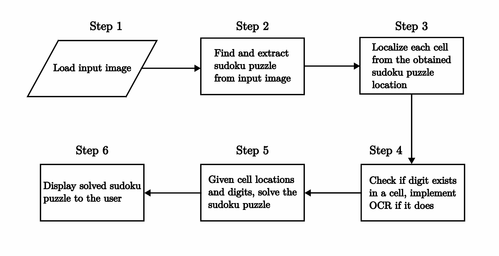
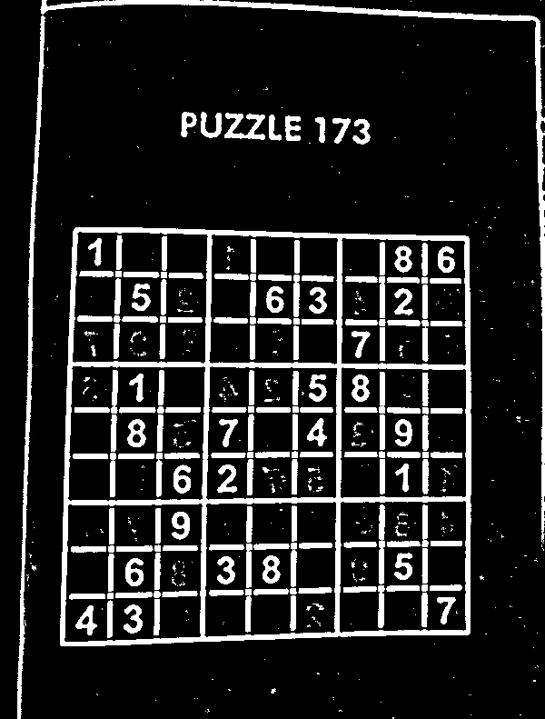
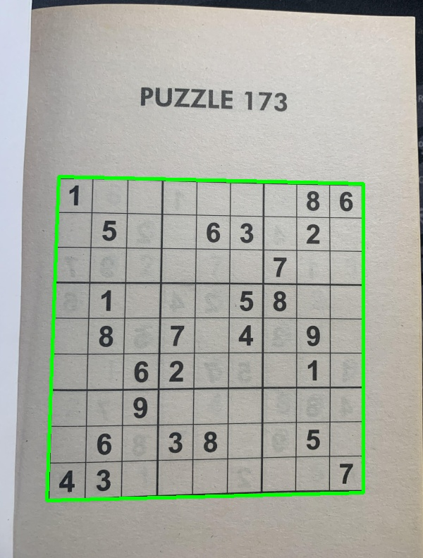
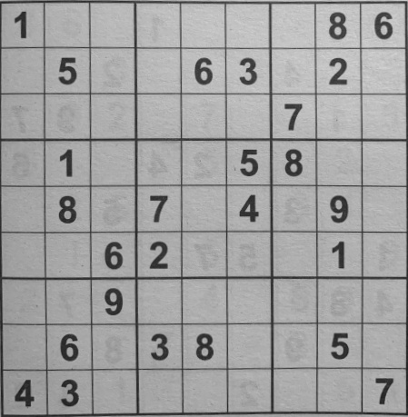
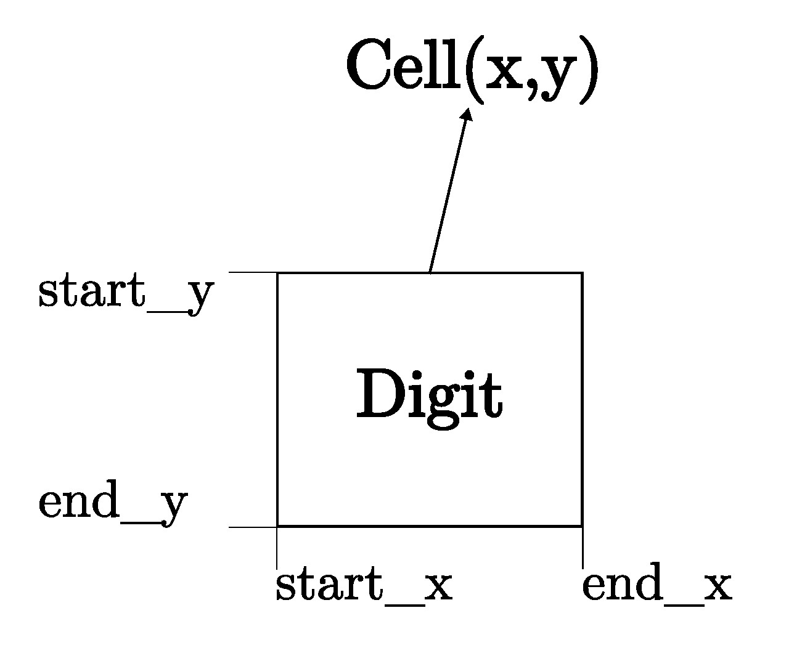
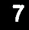
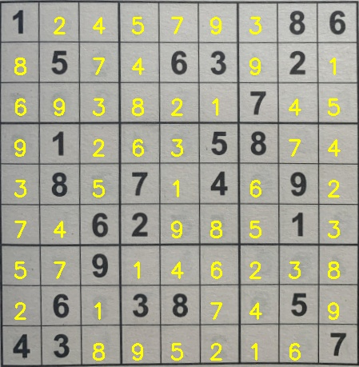

# Sudoku AI Solver

In this project, a Sudoku Artificial Intelligence (AI) puzzle solver is built using python, OpenCV, Deep Learning (DL) and OCR (Optical Character Recognition) methods to solve puzzles obtained from images. The steps required to implement the solver will be outlined after a brief overview of Sudoku puzzles.

(Work in progress)

## Sudoku
Sudoku is logic-based puzzle where the objective is to fill up a 9 x 9 grid with numbers from 1-9 in each row, each column and each mini 3 x 3 grid/block in such a way that each number does not appear more than once in a row, column or mini grid. Each puzzle contains prefilled numbers with the empty spaces are to be logically filled in with the Sudoku rules in mind. An example of a typical sudoku puzzle is shown below.

<p align='center'>
    
</p>

## Sudoku AI Solver Steps

The steps needed to build the sudoku AI solver are outlined in the following flow chart (adapted from [Pyimagesearch](https://pyimagesearch.com/2020/08/10/opencv-sudoku-solver-and-ocr/)).

<p align='center'>
    
</p>

The sudoku AI solver starts out by accepting an input image containing a sudoku puzzle. Next, OpenCV is applied to locate and extract the sudoku board from the image. After this, each cell of the board is located then checked if there is a digit in each cell or not. If there is a digit present, a Deep Learning trained Optical Character Recognition (OCR) model is employed to identify it. At this point, given the cell locations and digits, a python script is run to solve the sudoku puzzle. Finally, the solved puzzle is displayed as an image to the user.

Most of these steps can be accomplished using OpenCV, however, training the OCR model involves using the Keras and Tensorflow libraries. The packages, libraries and frameworks used in this project are listed below:

- [OpenCV](https://opencv.org/) - Open source library that provides real-time computer vision tools, functions and hardware.
- [JupyterLab](https://jupyter.org/) - Web-based interactive development environment for notebooks, code and data.
- [Tensorflow](https://www.tensorflow.org/) - An Artificial Intelligence library that is used to build, train and deploy Machine Learning and Deep Learning models.
- [Keras](https://keras.io/) - A Deep Learning library that provides an interface for Tensorflow.
- [Numpy](https://numpy.org/doc/stable/index.html) - A Python library used for multidimensional array manipulation and calculations, basic linear algebra, statistical operations and more. It is utilized by OpenCV for array operations. 
- [Matplotlib](https://matplotlib.org/) - Library used for visualizations in Python.
- [Scikit-image](https://scikit-image.org/) - Library used for image processing in Python.
- [Scikit-learn](https://scikit-learn.org/stable/) - Library used for Machine Learning in Python.
- [Imutils](https://pypi.org/project/imutils/) - Python package used for basic image processing operations.
- [Pytest](https://docs.pytest.org/en/7.1.x/) - Python testing framework used to write tests for applications and libraries.

Python is one of the main prerequisites for the project and can be downloaded from [here](https://www.python.org/downloads/). The python package manager, pip, is used to install the python packages in the list above -- pip can be installed from [here](https://pip.pypa.io/en/stable/installation/). Afterwards, the python packages are installed by executing this command in a terminal:

```
pip install numpy matplotlib imutils jupyter jupyterlab scikit-image tensorflow pytest
```

Keras is automatically installed with Tensorflow. OpenCV is installed separately and can be downloaded [here](https://docs.opencv.org/4.x/da/df6/tutorial_py_table_of_contents_setup.html) with options for Windows, Fedora and Ubuntu operating systems -- Ubuntu 20.04 is used for this project.

The `sudoku_puzzle_extractor.ipynb` jupyter notebook in this repository is the main file used to build the sudoku AI solver. The file was based on the steps used in this [Pyimagesearch article](https://pyimagesearch.com/2020/08/10/opencv-sudoku-solver-and-ocr/) with modifications to the functions in the jupyter notebook, the OCR model, the script that solves the extracted puzzle and more. 

A docker container, based on a custom image built on Ubuntu 20.04, which mirrors the project repository with all the necessary packages, libraries and frameworks, can also be used to run the main jupyter notebook to solve image extracted sudoku puzzles. The docker build is detailed in a subsequent subsection.

Now that the project software environment has been setup, it is time to build the Sudoku AI Solver.

### Load input image and extract sudoku puzzle

The input image is loaded into the `sudoku_puzzle_extractor.ipynb` notebook in the first line below:

```
img = cv2.imread('sudoku_images/sudoku.jpg')
img = imutils.resize(img, width=600)
```

In the second line, the image is resized to aid with image processing. The image needs to be processed before the puzzle can be extracted from it. The image is processed in the following steps and these are found in the `find_puzzle(img)` function in the notebook:

- <strong>Convert the resized image to grayscale</strong>
 
    This is achieved using the following OpenCV function:

    ```
    gray = cv2.cvtColor(img,cv2.COLOR_BGR2GRAY)
    ```

    This is a requirement for the other processing steps to work.

- <strong>Filter noise from the image</strong>
  
    The [Gaussian Blur](https://docs.opencv.org/4.x/d4/d86/group__imgproc__filter.html#gaabe8c836e97159a9193fb0b11ac52cf1) is used to filter noise from the image. The general form of the `cv2.GaussianBlur()` function syntax is as follows:

    <p align='center'><big>GaussianBlur(src, dst, ksize, sigmaX, sigmaY)</big></p>
    
    Where,

    - <strong>src</strong> - Input image.
    - <strong>dst</strong> - Output image of same size and type as src.
    - <strong>ksize</strong> - Gaussian kernel size[height width ]. The kernel is a group of pixels that move along the src image pixel being worked on by the filter. Height and width must be odd numbers and can have different values. If ksize is set to [0,0], then ksize is computed from sigma value.
    - <strong>sigmaX</strong> - Kernel standard derivation along X-axis.(horizontal direction).
    - <strong>sigmaY</strong> - Kernel standard derivation along Y-axis (vertical direction). If sigmaY = 0 then sigmaX value is taken for sigmaY.

    In the notebook, GaussianBlur is applied on the gray image with the following kernel size and sigmaX value:

    ```
    blurred = cv2.GaussianBlur(gray, (7,7), 3)
    ```
    
    More information on GaussianBlur and other OpenCV filtering and blurring techniques can be read about [here](https://datacarpentry.org/image-processing/06-blurring/) and [here](https://www.javatpoint.com/opencv-blur).

- <strong>Image thresholding</strong>

    The next image process step is <strong><em>thresholding</em></strong>. In attempting to find the puzzle from an image, being able to detect the edges and shapes within the image are important. Thresholding is a method of segmenting an image into different regions or contours. 
    
    A binary threshold is applied on the blurred grayscale image to convert it to consist of only two values, 0 or 255 - black or white respectively. The `cv2.adaptiveThreshold()` function was used to achieve this and it has the following [general syntax]((https://docs.opencv.org/4.x/d7/d1b/group__imgproc__misc.html#ga72b913f352e4a1b1b397736707afcde3)):
    <br />  

    <p align='center'><big>adaptiveThreshold(src, dst, maxValue, adaptiveMethod, thresholdType, blockSize, C)</big></p>

    Where,

    - <strong>src</strong> - Input image.
    - <strong>dst</strong> - Output image of same size and type as src.
    - <strong>maxValue</strong> - Non-zero value assigned to the pixels for which the condition is satisifed.
    - <strong>adaptiveMethod</strong> - Adaptive thresholding algorithm to use. There are two [adaptiveThreshold algorithms](https://docs.opencv.org/4.x/d7/d1b/group__imgproc__misc.html#gaa42a3e6ef26247da787bf34030ed772c): ADAPTIVE_THRESH_MEAN_C and ADAPTIVE_THRESH_GAUSSIAN_C.
    - <strong>thresholdType</strong> - Thresholding type that must be either THRESHOLD_BINARY or THRESHOLD_BINARY_INV.
    - <strong>blockSize</strong> - Size of a pixel neighborhood that is used to calculate a threshold value for the pixel: 3, 5, 7 and so on.
    - <strong>C</strong> - Constant subtracted from the mean or weighted mean. It is normally positive but may be zero or negative as well. 
    

    The following command in the notebook applies an adaptiveThreshold to the blurred grascale image:

    ```
    thresh = cv2.adaptiveThreshold(blurred, 255, cv2.ADAPTIVE_THRESH_GAUSSIAN_C, 
                                    cv2.THRESH_BINARY_INV, 11, 2)
    ```

    Here the maxValue is set to 255, any pixel value in the image above 255 is set to 0, otherwise it is set to 255. This happens because the thresholdType is set to THRESHOLD_BINARY_INV, where INV stands for Inverse. The thresholded image is shown below.

    <p align='center'>
        
    </p>

The next steps are to find the contours in the thresholded image and sort them in descending order to locate the outline of the sudoku puzzle. 

As the name suggests, the `cv2.findContours()` function is used to retrieve the contours from the thresholded image and its use is shown in the code block below:

```
# Find contours in the thresholded image and sort them by size in descending order
cnts = cv2.findContours(thresh.copy(), cv2.RETR_EXTERNAL, cv2.CHAIN_APPROX_SIMPLE)
cnts = imutils.grab_contours(cnts)
cnts = sorted(cnts, key=cv2.contourArea, reverse=True)
```

A copy of the thresholded image is passed into the function with the parameters: CHAIN_APPROX_SIMPLE, a contour approximation method which encodes a rectangular contuor with 4 points, and RETR_EXTERNAL, a contour retrieval method which retrieves only the extreme outer contours. Other options for contour approximation and retrieval modes are found [here](https://docs.opencv.org/4.x/d3/dc0/group__imgproc__shape.html#ga4303f45752694956374734a03c54d5ff) and [here](https://docs.opencv.org/4.x/d3/dc0/group__imgproc__shape.html#ga819779b9857cc2f8601e6526a3a5bc71) respectively. 

The `imutils` package function, `grab_contours()`, return the contours obtained in the previous line of code and these contours are then sorted by area in reverse order. Two OpenCV functions, `cv2.arcLength()` and `cv2.approxPolyDP()`, are used to determine the puzzle outline. The applications of these functions are shown in the code blocks below:

``` 
# Initialize a contour that corresponds to the puzzle outline
puzzle_cnt = None

# Loop over the contours
for c in cnts:
    # Approximate the coutour
    peri = cv2.arcLength(c, True) 
    approx = cv2.approxPolyDP(c, 0.02 * peri, True)

    # If the approximated contour has 4 points, then it is assumed that 
    # this contour is the puzzle outline
    if len(approx) == 4:
        puzzle_cnt = approx
        break
```

Firstly, the puzzle outline variable, `puzzle_cnt`, is initialized. Next the contours are looped over to find the perimeter of the contour with `cv2.arcLength()` while `cv2.approxPolyDP()` returns an approximated contour of the passed in contour. The figure <strong>0.02</strong> specifies the maximum variance between the original contour and the perimeter of the approximation, that is, the appromixation is 2% of the original contour. If the approximated contour has <strong>4</strong> points, it is assumed that this is the puzzle contour.

The obtained puzzle outline is drawn on the copy of the original image, using the `cv2.drawContours()` function, in the following lines of code:

```
puzzle_outline = img.copy()
cv2.drawContours(puzzle_outline, [puzzle_cnt], -1, (0, 255, 0), 3)
```

The contour index is <strong>-1</strong> and a negative value indicates that all contours are drawn, <strong>(0, 255, 0)</strong> is the line color (green in this case) and <strong>3</strong> is the line thickness. More information on `cv2.drawContours()` is available [here](https://docs.opencv.org/4.x/d6/d6e/group__imgproc__draw.html#ga746c0625f1781f1ffc9056259103edbc).

The puzzle outline is shown in the image below.

<p align='center'>
    
</p>

Before moving on to locating and extracting digits in the puzzle, it is necessary to deskew the puzzle image, to a top-down bird's eye view, to make it easier to determine rows, columns and cells of the sudoku puzzle. This operation is achieved by using the `four_point_transform()` function from the `imutils` package on both color and grayscale puzzle images:

```
color_puzzle = four_point_transform(img, puzzle_cnt.reshape(4,2)) 
gray_puzzle = four_point_transform(gray, puzzle_cnt.reshape(4,2))  
```
The method `reshape(4,2)` reshapes the array of the puzzle contour to have a shape of <strong>(4, 2)</strong>, the required format for the `four_point_transform()` function. The image below shows the grayscale version after applying the transform. 

<p align='center'>
    
</p>

The `find_puzzle()` function returns the transformed images `color_puzzle` and `gray_puzzle` that will be used in subsequent steps in the sudoku AI solver as shown in this line of the main program cell in the notebook: 

```
# Find puzzle in the image. Set debug to False to disable displaying image 
# processing steps.
color_puzzle, gray_puzzle = find_puzzle(img, debug=True)
```

The next step in the solver is to localize each cell in the puzzle.

### Localize each cell

In order to localize each cell, the sudoku board needs to be initialized, split into individual cells and then the (x-y) coordinate location of each cell is generated. The following lines in the main program cell achieve this:

```
# Initialize sudoku board
unsolved_board = np.zeros((9,9), dtype='int')

# Sudoku is a 9x9 grid (81 individual cells), location of each cell can be inferred by
# dividing the gray_puzzle image into a 9x9 grid
step_x = gray_puzzle.shape[1] // 9
step_y = gray_puzzle.shape[0] // 9

# Load model to detect digits
model = load_model('model_files/digit_classifier_model.h5')

# List of the (x-y) coordinate location of each cell
cell_locs = generate_cell_locations(step_x, step_y)
```
The OCR model is also loaded as it will be employed by the `classify_digit()` function called from the `generate_cell_locations()` function to classify digits; this process will be elaborated on later in this subsection. The steps of the `generate_cell_locations()` function are shown in the following code block:

```
# Initialize a list to store (x,y) coordinates of each cell location
cell_locs = []

# Loop over the grid lcoations
for y in range(9):
    # Initialize the current list of cell locations
    row = []

    for x in range(9):
        # Compute the starting and ending (x,y) coordinates of the current cell
        start_x = x * step_x
        start_y = y * step_y
        end_x = (x + 1) * step_x
        end_y = (y + 1) * step_y

        # Add the (x,y) coordinates to the cell locations list
        row.append((start_x, start_y, end_x, end_y))

        # Crop the cell from the gray_puzzle transformed image and then extract
        # the digit from the cell
        cell = gray_puzzle[start_y:end_y, start_x:end_x]
        digit = extract_digit(cell)

        # Confirm that the digit is not empty
        if digit is not None:
            classify_digit(digit, x, y)

    # Add the row to the cell locations
    cell_locs.append(row)

return cell_locs
```

The function starts by initializing a list, `cell_locs`, to store the (x, y) coordinates of each cell location. It then iterates over each grid location of the sudoku board, row by row, and appends the `start_x, start_y, end_x, end_y` values of each cell in a list. 

The figure below illustrates a typical cell with the start and end (x, y) coordinates.

<p align='center'>
    
</p>

For each iteration, the `generate_cell_locations()` function calls the `extract_digit()` function to determine if there is a digit present in the current cell. This process of digit extraction is shown in the code block below.

```
# Apply automatic thresholding to the cell and then clear any connected borders 
# that touch the border of the cell
thresh = cv2.threshold(cell, 0, 255, cv2.THRESH_BINARY_INV | cv2.THRESH_OTSU)[1]
thresh = clear_border(thresh)

# Find contours in the thresholded cell
cnts = cv2.findContours(thresh.copy(), cv2.RETR_EXTERNAL, cv2.CHAIN_APPROX_SIMPLE)
cnts = imutils.grab_contours(cnts)

# If no contours were found then this is an empty cell
if len(cnts)==0:
    return None

# Otherwise find the largest contour in the cell and create a mask for 
# the contour
c = max(cnts, key=cv2.contourArea)
mask = np.zeros(thresh.shape, dtype="uint8")
cv2.drawContours(mask, [c], -1, 255, -1)

# Compute the perecentage of masked pixels relative to the total area of the image
(h, w) = thresh.shape
percent_filled = cv2.countNonZero(mask) / float(w * h)

# If less than 3% of the mask is filled then we are looking at noise and 
# can safely ignore the contour
if percent_filled < 0.03:
    return None

# Apply the mask to the thresholded cell
digit = cv2.bitwise_and(thresh, thresh, mask=mask) 

return digit
```

Similar to finding the outline of the sudoku puzzle, thresholding techniques are also applied here in extracting the digit. The method `clear_border()` from the library `skimage.segmentation` is used to clear any connected borders touching a respective cell border. The next step is to find contours in the thresholded cell, if no contours are found, `None` is returned. If there are contours present in `cnts`, the largest contour by pixel area is found and a mask is created for it. 

Dividing the pixel area of the mask by the area of the cell itself gives the `percentFilled` value, that is, how much the cell is "filled up" with white pixels. This percentage is used to confirm if the contour is noisy or if contains a digit; any percentage less than 3% was assumed to be only noise. 

If the cell is not noisy, the mask is applied to the thresholded image and the digit is returned. As an example, the extracted cell of the bottom left hand corner from the puzzle `sudoku.jpg` is shown below.

<p align='center'>
    
</p>

The returned digit is then classified using the `classify_digit()` function with the steps shown in the following code block.

```
# Resize the digit to 28x28 pixels and prepare it classification. 
# 28x28 is the size of images in the MNIST dataset
roi = cv2.resize(digit, (28, 28))
roi = roi.astype("float")/255.0
roi = img_to_array(roi)
roi = np.expand_dims(roi, axis=0)

# Classify the digit and update the sudoku board with the prediction
pred = model.predict(roi, verbose=0).argmax(axis=1)[0]
unsolved_board[y, x] = pred
```

The digit, `roi`, is resized to 28x28 pixels -- the size of the images used in the MNIST dataset. This dataset contains 60,000 handwritten digits that will be used to train the deep learning model for optical character recognition. The `roi` digit is pre-processed before the `predict()` function is called on the `model` to predict the digit. The sudoku board is then updated with this prediction, thus replacing the default value of `0`.

The current row of the board is then appended to `cell_locs` list and this process continues until all the rows of the sudoku board have been worked on. 

The following section briefly explains the process involved in building the model, used by the `classify_digit()` function for OCR.


### OCR Model

Lorem ipsum

<!-- 60,000 28x28 images mnist dataset -->

<!-- Explain one hot encoding -->
<!-- necessary to talk about? model.metrics_names -->

<!-- The model is provided but you can train your own -->

<!-- You can train the model if the container if you want to. Navigate to the model_files folder and run the notebook there, make sure to change the name of the model to be saved at the end. -->


### Solve Sudoku puzzle

<!-- Backtracking and recursion

Flow chart to explain the process

Pytest -->

<!-- Try to keep this as small as possible as the main solver is well commented. Consider using a flow chart to show the solver process -->

### Display puzzle solutions
```
def display_solutions(cell_locs, color_puzzle):
    """
    This function displays the solutions of the sudoku puzzle on the color puzzle image.
    """
    
    global board, unsolved_board
    
    # Loop over the cell locations and boards
    for (cell_row, unsolved_board_row, solved_board_row) in zip(cell_locs, 
        unsolved_board, solved_board):
        
        # Loop over individual cells in the row
        for (box, unsolved_digit, solved_digit) in zip(cell_row, 
            unsolved_board_row, solved_board_row):
            if unsolved_digit == 0:
                # Unpack the cell coordinates
                start_x, start_y, end_x, end_y = box

                # Compute the coordinates of where the digit will be drawn 
                # on the output puzzle image
                text_x = int((end_x - start_x) * 0.33)
                text_y = int((end_y - start_y) * -0.2)
                text_x += start_x
                text_y += end_y

                # Draw the digit on the sudoku puzzle image
                cv2.putText(
                    color_puzzle, str(solved_digit), (text_x, text_y), 
                    cv2.FONT_HERSHEY_SIMPLEX, 0.9, (0, 255, 255), 2)
    
    display_img(color_puzzle, 'Solved Puzzle')
```

<p align='center'>
    
</p>

<!-- Need to circle back to introduce the main cell of the notebook, or do that here? -->
## Docker Image Build

The main Jupyter notebook and relevant files needed for this project can be run in a Docker container. 

First pull the image:

```
docker pull thenoobinventor/sudoku-ai-solver:latest
```

Then run a container based on the image:

```
docker run -it --rm -p 8890:8890 --name container_name sudoku-ai-solver
```

<!-- If you want to build an image from the Dockerfile instead:
docker build --load -t name:tag

List of packages that are installed are in the requirements.txt file -->

<!-- Running pytest in docker container, casual comment and relate it to the one we discussed before -->

<!-- Settings and go into dark mode -->

<!-- walkthrough of how to run the container -->

<!-- Add screenshots  -->

<!-- How you can train your own model and the issues with image quality etc -->

## Observations

Lorem ipsum


## Future work/suggestions

- Live stream video solver

- Mask solutions on original skewed image

## References

- [Base Sudoku Solver](https://www.youtube.com/watch?v=tvP_FZ-D9Ng)

- [Sudoku Solver using Computer Vision & Deep Learning](https://aakashjhawar.medium.com/sudoku-solver-using-opencv-and-dl-part-1-490f08701179)

- [Image Processing Sudoku AI](https://becominghuman.ai/image-processing-sudokuai-opencv-45380715a629)

- [OpenCV Sudoku Solver and OCR](https://pyimagesearch.com/2020/08/10/opencv-sudoku-solver-and-ocr/)

- [Using OpenCV to solve a sudoku](https://golsteyn.com/writing/sudoku)
  
- [OpenCV Docs](https://docs.opencv.org/4.x/d1/dfb/intro.html)
 
- [Understanding OpenCV getperspective transform](https://theailearner.com/tag/cv2-getperspectivetransform/)

- [Dockerfile setup reference](https://github.com/elehcimd/jupyter-opencv)
 
- [Add non-root user in Dockerfile](https://code.visualstudio.com/remote/advancedcontainers/add-nonroot-user)

