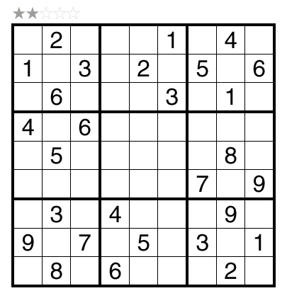
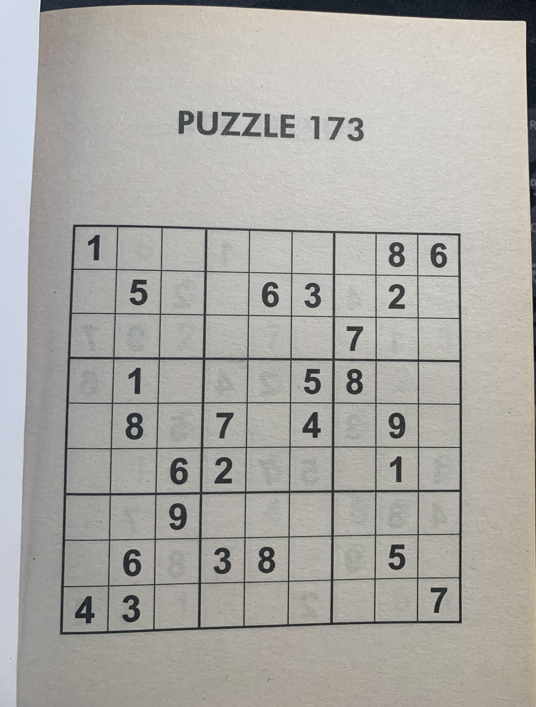
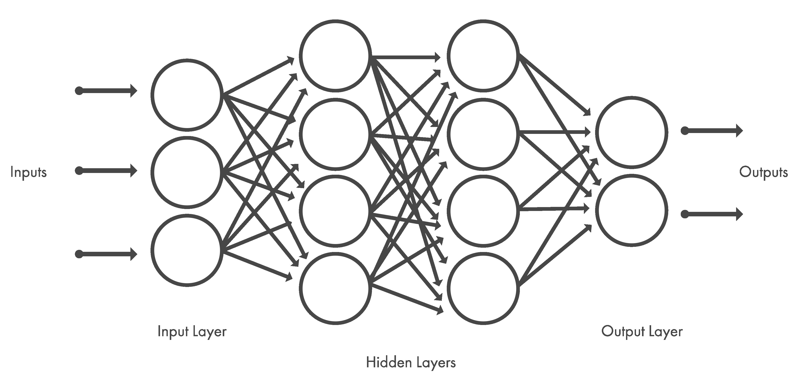
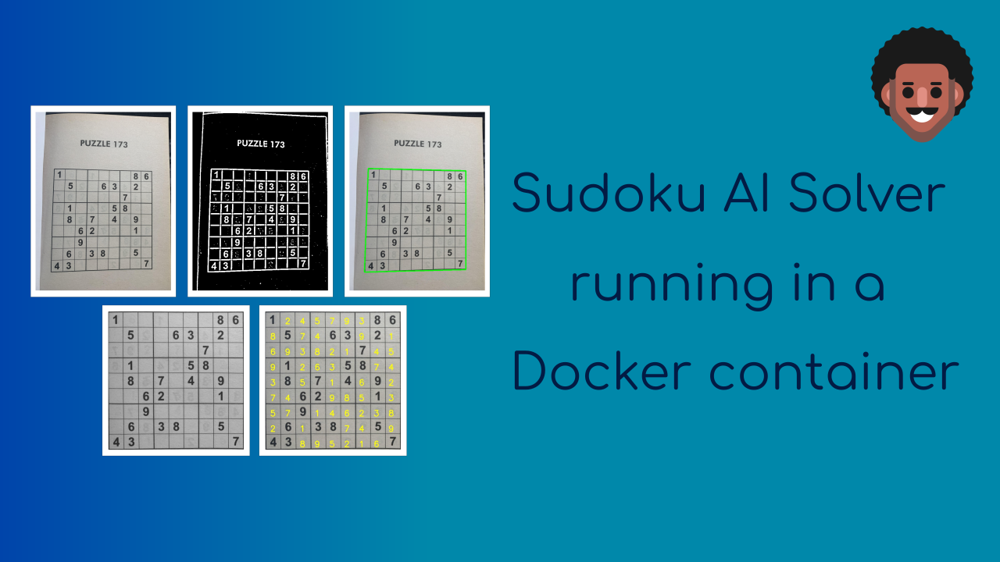

# Sudoku AI Solver

In this project, a Sudoku Artificial Intelligence (AI) puzzle solver is built using python, OpenCV, Deep Learning and Optical Character Recognition (OCR) methods to solve puzzles obtained from images. The steps required to implement the solver will be outlined after a brief overview of Sudoku puzzles.

## Sudoku
Sudoku is logic-based puzzle where the objective is to fill up a 9 x 9 grid with numbers from 1-9 in each row, each column and each mini 3 x 3 grid/block in a way that no number appears more than once in a row, column or mini grid. Each puzzle contains prefilled numbers with the empty cells/spaces to filled in with the Sudoku rules in mind. An example of a typical sudoku [puzzle](https://www.gmpuzzles.com/blog/category/sudoku/classic-sudoku/page/3/) is shown below.

<p align='center'>
    
</p>

## Sudoku AI Solver Steps

The steps needed to build the sudoku AI solver are outlined in the following flow chart (adapted from [Pyimagesearch](https://pyimagesearch.com/2020/08/10/opencv-sudoku-solver-and-ocr/)).

<p align='center'>
    
</p>

The sudoku AI solver starts out by accepting an input image containing a sudoku puzzle. Next, OpenCV is applied to locate and extract the sudoku board from the image. After this, each cell of the board is located then checked for digits in them. If there is a digit present, a Deep Learning model trained for Optical Character Recognition (OCR) is employed to identify it. At this point, given the cell locations and digits, a python script is run to solve the sudoku puzzle. Finally, the solved puzzle is displayed as an image to the user.

Most of these steps can be accomplished using OpenCV, however, training the OCR model involves using the Keras and Tensorflow libraries. The packages, libraries and frameworks used in this project are listed below:

- [OpenCV](https://opencv.org/) - Open source library that provides real-time computer vision tools, functions and hardware.
- [JupyterLab](https://jupyter.org/) - Web-based interactive development environment for notebooks, code and data.
- [Tensorflow](https://www.tensorflow.org/) - An Artificial Intelligence library that is used to build, train and deploy Machine Learning and Deep Learning models.
- [Keras](https://keras.io/) - A Deep Learning library that provides an interface for Tensorflow.
- [Numpy](https://numpy.org/doc/stable/index.html) - A Python library used for multidimensional array manipulation and calculations, basic linear algebra, statistical operations and more. It is utilized by OpenCV for array operations. 
- [Matplotlib](https://matplotlib.org/) - Library used for visualizations in Python.
- [Scikit-image](https://scikit-image.org/) - Library used for image processing in Python.
- [Scikit-learn](https://scikit-learn.org/stable/) - Library used for Machine Learning in Python.
- [Imutils](https://pypi.org/project/imutils/) - Python package used for basic image processing operations.
- [Pytest](https://docs.pytest.org/en/7.1.x/) - Python testing framework used to write tests for applications and libraries.

Python is one of the main prerequisites for the project and can be downloaded from [here](https://www.python.org/downloads/). The python package manager, pip, is used to install the python packages in the list above -- pip can be installed from [here](https://pip.pypa.io/en/stable/installation/). Afterwards, the python packages are installed by executing this command in a terminal:

```
pip install numpy matplotlib imutils jupyter jupyterlab scikit-image tensorflow pytest
```

Keras is automatically installed with Tensorflow. OpenCV is installed separately and can be downloaded [here](https://docs.opencv.org/4.x/da/df6/tutorial_py_table_of_contents_setup.html) with options for Windows, Fedora and Ubuntu operating systems -- Ubuntu 20.04 is used for this project.

The `sudoku_puzzle_extractor.ipynb` Jupyter notebook in this repository is the main file used to build the sudoku AI solver which runs in JupyterLab. The file was based on the steps used in this [Pyimagesearch article](https://pyimagesearch.com/2020/08/10/opencv-sudoku-solver-and-ocr/) with modifications to the functions in the Jupyter notebook, the OCR model, the script that solves the extracted puzzle and more. 

A Docker container, based on a custom image built on Ubuntu 20.04, which mirrors the project repository with all the necessary packages, libraries and frameworks, can also be used to run the main Jupyter notebook to solve image extracted sudoku puzzles. The Docker build is detailed in a subsequent subsection.

Now that the project software environment has been setup, it is time to start building the sudoku AI solver.

### Load input image and extract sudoku puzzle

The input image is loaded into the `sudoku_puzzle_extractor.ipynb` notebook in the first line below:

```
img = cv2.imread('sudoku_images/sudoku.jpg')
img = imutils.resize(img, width=600)
```

<p align='center'>
    
</p>

In the second line, the image is resized to aid with image processing. The image needs to be processed before the puzzle can be extracted from it. The image is processed in the following steps and these are found in the `find_puzzle(img)` function in the notebook:

- <strong>Convert the resized image to grayscale</strong>
 
    This is achieved using the following OpenCV function:

    ```
    gray = cv2.cvtColor(img,cv2.COLOR_BGR2GRAY)
    ```

    This is a requirement for the other processing steps to work.

- <strong>Filter noise from the image</strong>
  
    The [Gaussian Blur](https://docs.opencv.org/4.x/d4/d86/group__imgproc__filter.html#gaabe8c836e97159a9193fb0b11ac52cf1) is used to filter noise from the image. The general form of the `cv2.GaussianBlur()` function syntax is as follows:

    <p align='center'><big>GaussianBlur(src, dst, ksize, sigmaX, sigmaY)</big></p>
    
    Where,

    - <strong>src</strong> - Input image.
    - <strong>dst</strong> - Output image of same size and type as src.
    - <strong>ksize</strong> - Gaussian kernel size[height width ]. The kernel is a group of pixels that move along the src image pixel being worked on by the filter. Height and width must be odd numbers and can have different values. If ksize is set to [0,0], then ksize is computed from sigma value.
    - <strong>sigmaX</strong> - Kernel standard derivation along X-axis (horizontal direction).
    - <strong>sigmaY</strong> - Kernel standard derivation along Y-axis (vertical direction). If sigmaY = 0 then sigmaX value is taken for sigmaY.

    In the notebook, GaussianBlur is applied on the gray image with the following kernel size and sigmaX value:

    ```
    blurred = cv2.GaussianBlur(gray, (7,7), 3)
    ```
    
    More information on GaussianBlur and other OpenCV filtering and blurring techniques can be read about [here](https://datacarpentry.org/image-processing/06-blurring/) and [here](https://www.javatpoint.com/opencv-blur).

- <strong>Image thresholding</strong>

    The next image processing step is <strong><em>thresholding</em></strong>. In attempting to find the puzzle from an image, being able to detect the edges and shapes within the image are important. Thresholding is a method of segmenting an image into different regions or contours. 
    
    A binary threshold is applied on the blurred grayscale image to convert it to consist of only two values, 0 or 255 - black or white respectively. The `cv2.adaptiveThreshold()` function was used to achieve this and it has the following [general syntax]((https://docs.opencv.org/4.x/d7/d1b/group__imgproc__misc.html#ga72b913f352e4a1b1b397736707afcde3)):
    <br />  

    <p align='center'><big>adaptiveThreshold(src, dst, maxValue, adaptiveMethod, thresholdType, blockSize, C)</big></p>

    Where,

    - <strong>src</strong> - Input image.
    - <strong>dst</strong> - Output image of same size and type as src.
    - <strong>maxValue</strong> - Non-zero value assigned to the pixels for which the condition is satisifed.
    - <strong>adaptiveMethod</strong> - Adaptive thresholding algorithm to use. There are two [adaptiveThreshold algorithms](https://docs.opencv.org/4.x/d7/d1b/group__imgproc__misc.html#gaa42a3e6ef26247da787bf34030ed772c): ADAPTIVE_THRESH_MEAN_C and ADAPTIVE_THRESH_GAUSSIAN_C.
    - <strong>thresholdType</strong> - Thresholding type that must be either THRESHOLD_BINARY or THRESHOLD_BINARY_INV.
    - <strong>blockSize</strong> - Size of a pixel neighborhood that is used to calculate a threshold value for the pixel: 3, 5, 7 and so on.
    - <strong>C</strong> - Constant subtracted from the mean or weighted mean. It is normally positive but may be zero or negative as well. 
    

    The following command in the notebook applies an adaptiveThreshold to the blurred grascale image:

    ```
    thresh = cv2.adaptiveThreshold(blurred, 255, cv2.ADAPTIVE_THRESH_GAUSSIAN_C, 
                                    cv2.THRESH_BINARY_INV, 11, 2)
    ```

    Here the maxValue is set to 255, any pixel value in the image above 255 is set to 0, otherwise it is set to 255. This happens because the thresholdType is set to THRESHOLD_BINARY_INV, where INV stands for <em>inverse</em>. The thresholded image is shown below.

    <p align='center'>
        
    </p>

The next steps are to find the contours in the thresholded image and sort them in descending order to locate the outline of the sudoku puzzle. 

As the name suggests, the `cv2.findContours()` function is used to retrieve the contours from the thresholded image and its use is shown in the code block below:

```
# Find contours in the thresholded image and sort them by size in descending order
cnts = cv2.findContours(thresh.copy(), cv2.RETR_EXTERNAL, cv2.CHAIN_APPROX_SIMPLE)
cnts = imutils.grab_contours(cnts)
cnts = sorted(cnts, key=cv2.contourArea, reverse=True)
```

A copy of the thresholded image is passed into the function with the parameters: CHAIN_APPROX_SIMPLE, a contour approximation method which encodes a rectangular contuor with 4 points, and RETR_EXTERNAL, a contour retrieval method which retrieves only the extreme outer contours. Other options for contour approximation and retrieval modes are found [here](https://docs.opencv.org/4.x/d3/dc0/group__imgproc__shape.html#ga4303f45752694956374734a03c54d5ff) and [here](https://docs.opencv.org/4.x/d3/dc0/group__imgproc__shape.html#ga819779b9857cc2f8601e6526a3a5bc71) respectively. 

The `imutils` package function, `grab_contours()`, returns the contours obtained in the previous line of code and these contours are then sorted by area in reverse/descending order. Two OpenCV functions, `cv2.arcLength()` and `cv2.approxPolyDP()`, are used to determine the puzzle outline. The applications of these functions are shown in the code blocks below:

``` 
# Initialize a contour that corresponds to the puzzle outline
puzzle_cnt = None

# Loop over the contours
for c in cnts:
    # Approximate the coutour
    peri = cv2.arcLength(c, True) 
    approx = cv2.approxPolyDP(c, 0.02 * peri, True)

    # If the approximated contour has 4 points, then it is assumed that 
    # this contour is the puzzle outline
    if len(approx) == 4:
        puzzle_cnt = approx
        break
```

Firstly, the puzzle outline variable, `puzzle_cnt`, is initialized. , the contours are looped over to find the perimeter of the contour with `cv2.arcLength()` while `cv2.approxPolyDP()` returns an approximated contour of the passed in contour. The figure <strong>0.02</strong> specifies the maximum variance between the original contour and the perimeter of the approximation, that is, the appromixation is 2% of the original contour. If the approximated contour has <strong>4</strong> points, it is assumed that this is the puzzle contour.

The obtained puzzle outline is drawn on the copy of the original image, using the `cv2.drawContours()` function, in the following lines of code:

```
puzzle_outline = img.copy()
cv2.drawContours(puzzle_outline, [puzzle_cnt], -1, (0, 255, 0), 3)
```

The contour index is <strong>-1</strong> and a negative value indicates that all contours are drawn, <strong>(0, 255, 0)</strong> is the line color (green in this case) and <strong>3</strong> is the line thickness. More information on `cv2.drawContours()` is available [here](https://docs.opencv.org/4.x/d6/d6e/group__imgproc__draw.html#ga746c0625f1781f1ffc9056259103edbc).

The puzzle outline is shown in the image below.

<p align='center'>
    
</p>

Before moving on to locating and extracting digits in the puzzle, it is necessary to deskew the puzzle image, to a top-down bird's eye view to make it easier to determine rows, columns and cells of the sudoku puzzle. This operation is achieved by using the `four_point_transform()` function from the `imutils` package on both color and grayscale puzzle images:

```
color_puzzle = four_point_transform(img, puzzle_cnt.reshape(4,2)) 
gray_puzzle = four_point_transform(gray, puzzle_cnt.reshape(4,2))  
```
The method `reshape(4,2)` reshapes the array of the puzzle contour to have a shape of <strong>(4, 2)</strong>, the required format for the `four_point_transform()` function. The image below shows the grayscale version after applying the transform. 

<p align='center'>
    
</p>

The `find_puzzle()` function returns the transformed images `color_puzzle` and `gray_puzzle` that will be used in subsequent steps in the sudoku AI solver as shown in this line of the main program cell in the notebook: 

```
# Find puzzle in the image. Set debug to False to disable displaying image 
# processing steps.
color_puzzle, gray_puzzle = find_puzzle(img, debug=True)
```

The next step in the solver is to localize each cell in the puzzle.

### Localize each cell

In order to localize each cell, the sudoku board needs to be initialized, split into individual cells and then generate the (x-y) coordinate location of each cell. The following lines in the main program cell achieve this:

```
# Initialize sudoku board
unsolved_board = np.zeros((9,9), dtype='int')

# Sudoku is a 9x9 grid (81 individual cells), location of each cell can be inferred by
# dividing the gray_puzzle image into a 9x9 grid
step_x = gray_puzzle.shape[1] // 9
step_y = gray_puzzle.shape[0] // 9

# Load model to detect digits
model = load_model('model_files/digit_classifier_model.h5')

# List of the (x-y) coordinate location of each cell
cell_locs = generate_cell_locations(step_x, step_y)
```
The OCR model is also loaded as it will be employed by the `classify_digit()` function called from the `generate_cell_locations()` function to classify digits; this process will be elaborated on later in this subsection. The steps of the `generate_cell_locations()` function are shown in the following code block:

```
# Initialize a list to store (x,y) coordinates of each cell location
cell_locs = []

# Loop over the grid lcoations
for y in range(9):
    # Initialize the current list of cell locations
    row = []

    for x in range(9):
        # Compute the starting and ending (x,y) coordinates of the current cell
        start_x = x * step_x
        start_y = y * step_y
        end_x = (x + 1) * step_x
        end_y = (y + 1) * step_y

        # Add the (x,y) coordinates to the cell locations list
        row.append((start_x, start_y, end_x, end_y))

        # Crop the cell from the gray_puzzle transformed image and then extract
        # the digit from the cell
        cell = gray_puzzle[start_y:end_y, start_x:end_x]
        digit = extract_digit(cell)

        # Confirm that the digit is not empty
        if digit is not None:
            classify_digit(digit, x, y)

    # Add the row to the cell locations
    cell_locs.append(row)

return cell_locs
```

The function starts by initializing a list, `cell_locs`, to store the (x, y) coordinates of each cell location. It then iterates over each grid location of the sudoku board, row by row, and appends the `start_x, start_y, end_x, end_y` values of each cell in a list. 

The figure below illustrates a typical cell with the start and end (x, y) coordinates.

<p align='center'>
    
</p>

For each iteration, the `generate_cell_locations()` function calls the `extract_digit()` function to determine if there is a digit present in the current cell. This process of digit extraction is shown in the code block below:

```
# Apply automatic thresholding to the cell and then clear any connected borders 
# that touch the border of the cell
thresh = cv2.threshold(cell, 0, 255, cv2.THRESH_BINARY_INV | cv2.THRESH_OTSU)[1]
thresh = clear_border(thresh)

# Find contours in the thresholded cell
cnts = cv2.findContours(thresh.copy(), cv2.RETR_EXTERNAL, cv2.CHAIN_APPROX_SIMPLE)
cnts = imutils.grab_contours(cnts)

# If no contours were found then this is an empty cell
if len(cnts)==0:
    return None

# Otherwise find the largest contour in the cell and create a mask for 
# the contour
c = max(cnts, key=cv2.contourArea)
mask = np.zeros(thresh.shape, dtype="uint8")
cv2.drawContours(mask, [c], -1, 255, -1)

# Compute the perecentage of masked pixels relative to the total area of the image
(h, w) = thresh.shape
percent_filled = cv2.countNonZero(mask) / float(w * h)

# If less than 3% of the mask is filled then we are looking at noise and 
# can safely ignore the contour
if percent_filled < 0.03:
    return None

# Apply the mask to the thresholded cell
digit = cv2.bitwise_and(thresh, thresh, mask=mask) 

return digit
```

Similar to finding the outline of the sudoku puzzle, thresholding techniques are also applied here in extracting the digit. The function `clear_border()`, from the `skimage.segmentation` library, is used to clear any connected borders touching a respective cell border. The next step is to find contours in the thresholded cell, if no contours are found, `None` is returned. If there are contours present in `cnts`, the largest contour by pixel area is found and a mask is created for it. 

Dividing the pixel area of the mask by the area of the cell itself gives the `percentFilled` value, that is, how much the cell is "filled up" with white pixels. This percentage is used to confirm if the contour is noisy or if contains a digit; any percentage less than 3% is assumed to contain only noise. 

If the cell is not noisy, the mask is applied to the thresholded image and the digit is returned. As an example, the extracted cell of the bottom left hand corner from the puzzle `sudoku.jpg` is shown below.

<p align='center'>
    
</p>

The returned digit is then classified using the `classify_digit()` function with the steps shown in the following code block:

```
# Resize the digit to 28x28 pixels and prepare it classification. 
# 28x28 is the size of images in the MNIST dataset
roi = cv2.resize(digit, (28, 28))
roi = roi.astype("float")/255.0
roi = img_to_array(roi)
roi = np.expand_dims(roi, axis=0)

# Classify the digit and update the sudoku board with the prediction
pred = model.predict(roi, verbose=0).argmax(axis=1)[0]
unsolved_board[y, x] = pred
```

The digit, `roi`, is resized to 28x28 pixels -- the size of the images in the MNIST dataset used to train deep learning models for optical character recognition. The `roi` digit is preprocessed before the `predict()` method is called on the `model` to predict the digit. The sudoku board is then updated with this prediction, thus replacing the default value of 0.

The current row of the board is appended to `cell_locs` list and this process continues until all the rows of the sudoku board have been worked on. 

The following subsection briefly explains the process involved in building the deep learning model used by the `classify_digit()` function for OCR.

### Deep Learning model for Optical Character Recognition (OCR)

Deep learning is a subset of Machine Learning (itself a subset of Artificial Intelligence) techniques that use artificial neural network architectures to learn from data. [Neural networks](https://www.ibm.com/cloud/learn/deep-learning) are layers of nodes, similar to the neurons in the human brain, that attempt to simulate the brain's ability to learn from large amounts of data and make predictions. The nodes within individual layers are connected to [adjacent ones](https://www.simplilearn.com/tutorials/deep-learning-tutorial/what-is-deep-learning). The network is said to be <em>'deep'</em> depending on the number of hidden layers it has. Traditional [neural networks](https://www.mathworks.com/discovery/deep-learning.html) only contain 2-3 hidden layers, while deep networks can have as many as 150. 

The [figure](https://www.mathworks.com/discovery/deep-learning.html) below shows the layout of a typical neural network. 

<p align='center'>
    
</p>

Deep learning models are trained using a large set of labeled data and neural network architectures that learn features directly from the data without the need for manual feature extraction. Convolutional neural network (CNN or ConvNet) is one of the most popular types of deep neural networks. A CNN convolves learned features with input data, and uses 2D convolutional layers, making this architecture well suited to processing 2D data, such as images.

The CNN works by extracting features directly from images. The relevant features are not pretrained; they are learned while the network trains on a collection of images. This automated feature extraction makes deep learning models highly accurate for computer vision tasks such as object classification. The [figure](https://towardsdatascience.com/a-comprehensive-guide-to-convolutional-neural-networks-the-eli5-way-3bd2b1164a53) below illustrates the CNN process for classifying handwritten digits. 

<p align='center'>
    
</p>

More information about convolutional neural networks can be found [here](https://towardsdatascience.com/a-comprehensive-guide-to-convolutional-neural-networks-the-eli5-way-3bd2b1164a53) and [here](https://www.simplilearn.com/tutorials/deep-learning-tutorial/convolutional-neural-network). 

To perform optical character recognition on the digits obtained from the `extract_digit()`, a convolutional neural model is built and trained using the [MNIST dataset](http://yann.lecun.com/exdb/mnist/). The MNIST dataset is a classic dataset that contains 28x28 pixels sized images of handwritten digits, with 60,000 images for model training and 10,000 images for model testing. The handwritten images are grayscale single digits from 0 to 9. A sample of these images is shown [below](https://en.wikipedia.org/wiki/MNIST_database).

<p align='center'>
    
</p>

The MNIST dataset is part of the Keras deep learning library so it only needs to be loaded to the `train_digit_classifier.ipynb` notebook, in the `model_files` directory, used to build and train the OCR deep learning model.

To build the deep learning model, the following packages need to be imported into the `train_digit_classifier.ipynb` notebook:

```
import numpy as np
import matplotlib.pyplot as plt
from keras.datasets import mnist
from keras.utils.np_utils import to_categorical
from keras.models import Sequential
from keras.layers import Dense, Conv2D, MaxPool2D, Flatten, Dropout, Activation
from sklearn.metrics import classification_report
```

Next, the MNIST dataset is loaded and split into training and test data and labels.

```
(train_data, train_labels), (test_data, test_labels) = mnist.load_data()
```

After loading the dataset, the data needs to be preprocessed before using it to build the model. One of these processes is to one hot encode the test and train data labels. The original labels of the images are given as a list of numbers: `[4,5,7,...,0,9,1]`. These need to be converted to one-hot encoding.

In one-hot encoding, the label of an image is based off the index position in the label array. For instance, a drawn digit of 4 would have the label array:

-`[0, 0, 0, 0, 1, 0, 0, 0, 0, 0]`

Or the integer 9 would be encoded as:

-`[0, 0, 0, 0, 0, 0, 0, 0, 0, 1]`

Without one-hot encoding, the neural network might think there could be values between numbers in a list instead of distinct categories or labels. One-hot encoding is easily done in Keras with the utility function, `to_categorical()` which accepts data and the number of classes (0 - 9) as arguments. 

```
test_labels = to_categorical(test_labels, 10)
train_labels = to_categorical(train_labels, 10)
```

The next preprocess step is to normalize the test and train data to range [0, 1].

```
train_data = train_data / 255
test_data = test_data / 255
```

The final step before building is the model is to reshape the test and train data to include color channels. Only one channel is included here for grayscale.

```
train_data = train_data.reshape(train_data.shape[0], 28, 28, 1)
test_data = test_data.reshape(test_data.shape[0], 28, 28, 1)
```

With the data preprocessed, it is time to build the model. The paramters used to build the following CNN model were obtained from [here](https://becominghuman.ai/part-3-solving-the-sudoku-ai-solver-13f64a090922).

```
# Create model
model = Sequential()

# First set of Convolution layer
model.add(Conv2D(32, (3, 3), activation='relu', kernel_initializer='he_uniform', 
input_shape=(28, 28, 1)))

# Pooling layer
model.add(MaxPool2D((2, 2)))

# Second set of Convolution layer
model.add(Conv2D(64, (3, 3), activation='relu', kernel_initializer='he_uniform'))

# Third set of Convolution layer
model.add(Conv2D(64, (3, 3), activation='relu', kernel_initializer='he_uniform'))

# Pooling layer
model.add(MaxPool2D((2, 2)))

# Flat layer: 2 Dimension --> 1 Dimension
model.add(Flatten())
model.add(Dense(100, activation='relu', kernel_initializer='he_uniform'))

# Output layer/classifer
model.add(Dense(10, activation='softmax'))

# Compile model
model.compile(loss='categorical_crossentropy', optimizer='adam', metrics=['accuracy'])
```

The summary of the built model is shown below.

```
Model: "sequential"
_________________________________________________________________
 Layer (type)                Output Shape              Param #   
=================================================================
 conv2d (Conv2D)             (None, 26, 26, 32)        320       
                                                                 
 max_pooling2d (MaxPooling2D  (None, 13, 13, 32)       0         
 )                                                               
                                                                 
 conv2d_1 (Conv2D)           (None, 11, 11, 64)        18496     
                                                                 
 conv2d_2 (Conv2D)           (None, 9, 9, 64)          36928     
                                                                 
 max_pooling2d_1 (MaxPooling  (None, 4, 4, 64)         0         
 2D)                                                             
                                                                 
 flatten (Flatten)           (None, 1024)              0         
                                                                 
 dense (Dense)               (None, 100)               102500    
                                                                 
 dense_1 (Dense)             (None, 10)                1010      
                                                                 
=================================================================
Total params: 159,254
Trainable params: 159,254
Non-trainable params: 0
```

The model is trained using the `fit()` function below. An epoch is the number of times the network goes through the training set. 

```
model.fit(train_data, train_labels, epochs=20)
```

The following is an excerpt from the model training output.

```
Epoch 1/20
1875/1875 [==============================] - 34s 18ms/step - loss: 0.1174 - accuracy: 0.9637
Epoch 2/20
1875/1875 [==============================] - 34s 18ms/step - loss: 0.0414 - accuracy: 0.9876
Epoch 3/20
1875/1875 [==============================] - 35s 19ms/step - loss: 0.0300 - accuracy: 0.9907
Epoch 4/20
1875/1875 [==============================] - 35s 19ms/step - loss: 0.0208 - accuracy: 0.9934
Epoch 5/20
1875/1875 [==============================] - 34s 18ms/step - loss: 0.0164 - accuracy: 0.9949
Epoch 6/20
1625/1875 [=========================>....] - ETA: 4s - loss: 0.0116 - accuracy: 0.9965
---
Epoch 17/20
1875/1875 [==============================] - 33s 17ms/step - loss: 0.0051 - accuracy: 0.9983
Epoch 18/20
1875/1875 [==============================] - 33s 17ms/step - loss: 0.0048 - accuracy: 0.9984
Epoch 19/20
1875/1875 [==============================] - 33s 17ms/step - loss: 0.0050 - accuracy: 0.9986
Epoch 20/20
1875/1875 [==============================] - 33s 18ms/step - loss: 0.0049 - accuracy: 0.9987
```

The next action to be carried is to predict classes on the test images; images that the model is yet to see.

```
predictions = model.predict(test_data)
```

The correct answers, `test_labels`, are compared with the generated predictions using the `classification_report()` function from the `sklearn.metrics` package.

```
print(classification_report(test_labels.argmax(axis=1), predictions.argmax(axis=1)))
```

The report output is shown below and it can be observed that the accuracy, precision, recall and f1-score are all 99%.

```
              precision    recall  f1-score   support

           0       0.99      0.99      0.99       980
           1       1.00      0.99      1.00      1135
           2       0.98      1.00      0.99      1032
           3       1.00      0.99      0.99      1010
           4       0.99      0.99      0.99       982
           5       0.98      0.99      0.99       892
           6       0.99      0.99      0.99       958
           7       0.99      0.99      0.99      1028
           8       1.00      0.98      0.99       974
           9       0.99      0.98      0.98      1009

    accuracy                           0.99     10000
   macro avg       0.99      0.99      0.99     10000
weighted avg       0.99      0.99      0.99     10000
```

The trained model can be saved by running the following command in the notebook.

```
model.save('model_name.h5')
```

This project already has a trained model, `digit_classifier_model.h5`, present in the `model_files` directory, used to OCR the extracted digit. 

At this stage of the sudoku AI solver, the trained model has classified the extracted digits from the previous and substituted them in the respective cells of `unsolved_board`. The next step is to use the `solve_sudoku.py` Python script to solve the `unsolved_board` sudoku puzzle.

### Solve Sudoku puzzle

Going back the main program cell in the `sudoku_puzzle_extractor.ipynb` notebook, the `unsolved_board` puzzle is converted to a list data type prior to making any solving attempts. This conversion is necessary as the `solve_sudoku.py` script was written to solve a sudoku puzzle in a list format and not a numpy array.

```
unsolved_board = unsolved_board.tolist()
```

Finally a deep copy of the `unsolved_board` puzzle list is made before passing it into the `solve_puzzle()` function from the `solve_sudoku.py` script. This is done to enable the sudoku puzzle solutions to be overlayed (using the `display_solutions()` function discussed in the next subsection) on the puzzle image while avoiding cells with numbers already present.

```
unsolved_board_copy = copy.deepcopy(unsolved_board) 

# Solve puzzle
solved_board = solve_puzzle(unsolved_board_copy, debug=False)
```

To solve the sudoku puzzle, <em><strong>recursion</strong></em> and <em><strong>backtracking</strong></em> are used. Recursion involves a function calling itself until a base case is reached. For example, to compute the factorial of 5, a function like the one below can be used:

```
def factorial(x):
    if x ==  0: # Base case
        return 1
    return x * factorial(x - 1)
```

Calling `factorial(5)` results to the number 120. The steps of recursively arriving at this output are shown below:
```
factorial(5) =  5 x factorial(4)
                5 x 4 x factorial(3)
                5 x 4 x 3 x factorial(2)    
                5 x 4 x 3 x 2 x factorial(1)
                5 x 4 x 3 x 2 x 1 x factorial(0)
                5 x 4 x 3 x 2 x 1 x 1 = 120
```

The base case, `factorial(0) = 1`, is the terminating condition to ensure that the function does not keep recursively calling itself until the program crashes; due to the limit to the number of recursive calls that can be made.

Backtracking is an algorithmic technique for solving constraint-satisfaction problems  recursively without trying all possibilities. Some algorithms that employ [backtracking](https://cs.lmu.edu/~ray/notes/backtracking/) include:

 - N-Queens problem in chess,
 - Traveling salesperson problem,
 - Graph coloring problem, and 
 - Sudoku.
 
In the case of solving sudoku puzzles, valid guesses to solve the puzzle are constrained by the rules of the game. For a number to be part of a valid set of guesses (recall that guesses can only be from 1 to 9) to fill up an empty cell on the board, the number should <strong>not</strong>:

- already be present in the associated row of the empty cell,
- already be present in the associated column of the empty cell, and
- already be present in the associated 3x3 block of the empty cell.

To solve a sudoku puzzle using backtracking, start out with the first empty cell on the board, and the first number from a set of valid guesses is chosen to fill up the cell. The next empty cell is worked on and the first number from the a valid set of guesses is chosen to fill out the cell. If an empty cell is reached that does not have any valid guesses, the solver backtracks to the previous cell and chooses the next guess in the set of valid guesses and tries moving forward. This process continues until the puzzle is solved. 

A sample of this [sudoku]((https://en.wikipedia.org/wiki/Sudoku)) solving backtracking process is shown in the diagram below.

<p align='center'>
    
</p>

The `solve_puzzle()` function, from the `solve_sudoku.py` script, is the function that attempts to solve the `unsolved_board_copy` puzzle. The `solve_puzzle()` code block is shown below:

```
# If debug is set to True, check if puzzle is valid
if debug:
    if not is_puzzle_valid(puzzle):
        return False

# Find the next empty space of the puzzle to guess in
row, col = find_next_empty(puzzle)

# If find_next_empty() returns None, None that means there is no free space/element left in the
# puzzle. Since only valid guesses are filled in (using is_guess_valid() function), the puzzle has been solved.
if row is None:
    return puzzle

# If there is a space in the puzzle, pick a number from 1 - 9
for guess in range(1, 10): 

    # Check if guess is valid
    if is_guess_valid(puzzle, guess, row, col):

        # Place valid guess in the current empty space of the puzzle
        puzzle[row][col] = guess

        # Recursively call the solve_puzzle() function. Returning True means that the puzzle is solved, 
        # from row/column having a value of None.
        if solve_puzzle(puzzle):
            return puzzle

    # If the current guess is not valid, then backtrack and try a different number
    puzzle[row][col] = 0

# If none of the guesses work, this current iteration of the recursive function is closed and 
# operation is moved up the previous level. If at the end, none of the numbers tried works, the puzzle
# is declared unsolvable.
return False
```

The function starts out by checking if the debug flag is set to `True`. This feature was added to confirm if the puzzle, prior to any solving attempts, is valid; not having any duplicates in a row, column or 3x3 puzzle block. The puzzle validity check slows the performance of the function, thus the flag is set to `False` by default. The flag is only set to `True` to unit test the script with Pytest, discussed afterwards, and to troubleshoot errors encountered in solving the puzzle.

The next step is to find the next empty space/cell in the puzzle to guess in. With an empty cell, guesses to fill up the cell are checked for validity using the constraints enumerated earlier. Once the first valid guess is found, it is inputted into the empty cell. After this, `solve_puzzle()` recursively calls itself and the whole process of picking guesses to fill up empty cells, as explained earlier with the aid of the diagram, is repeated until the puzzle is solved. If there are no more empty cells, the puzzle has been solved and is returned to the `solved_board` variable.

The utility functions used by the `solve_puzzle()` function are well documented and can be viewed in the `solve_sudoku.py` script. Credit for the base sudoku solver is attributed to [Kylie Ying](https://www.youtube.com/watch?v=tvP_FZ-D9Ng).

<strong>Side note about Unit Testing</strong>

Before advancing to the final step of the sudoku AI solver, the unit tests for the sudoku solver script will be considered. The test script, `test_solve_sudoku.py`, was written to test edge cases and catch exceptions that the `solve_sudoku.py` might encounter. The test script initializes the following puzzle lists: `puzzle_1`, `solution_1`, `puzzle_2`, `puzzle_3`, and `puzzle_4`. Where `puzzle_1` is a puzzle to be solved and `solution_1` is its solution. The lists `puzzle_2`, `puzzle_3` and `puzzle_4` are invalid puzzles that need to have their resultant exceptions caught.

The unit tests carried out on the sudoku solver:

- Test to confirm that the puzzle and solution are not the same before invoking the solve_puzzle() method,

- Test to confirm that the puzzle has an element that is not of type `int`,

- Test to confirm that the solved puzzle and the provide solution are the same,

- Test to confirm that there is a duplicate in a puzzle row, and

- Test to confirm that there is a duplicate in a puzzle block.

The following command runs the unit tests using Pytest:

```
pytest test_solve_sudoku.py
```

This command can also be run in the Docker container (to be discussed in a subsequent subsection) of this project.

### Display puzzle solutions

Assuming that there are no errors encountered when attempting to solve the sudoku puzzle, the solved puzzle is returned to the `solved_board` variable and the solutions are displayed on the extracted color puzzle image using the function, `display_solutions(cell_locs, color_puzzle)`. This is expressed in the following lines from the main Jupyter notebook:

```
if not solved_board:
    print('\nPuzzle could not be solved, check training model.\n')
else:
    display_solutions(cell_locs, color_puzzle)
```

The solver script returns `False` if an error occurs, otherwise the returned solved puzzle equates to `True`. The code block for the `display_solutions()` function is shown below.

```
# Loop over the cell locations and boards
for (cell_row, unsolved_board_row, solved_board_row) in zip(cell_locs, unsolved_board, solved_board):
    
    # Loop over individual cells in the row
    for (box, unsolved_digit, solved_digit) in zip(cell_row, unsolved_board_row, solved_board_row):
        if unsolved_digit == 0:
            # Unpack the cell coordinates
            start_x, start_y, end_x, end_y = box

            # Compute the coordinates of where the digit will be drawn 
            # on the output puzzle image
            text_x = int((end_x - start_x) * 0.33)
            text_y = int((end_y - start_y) * -0.2)
            text_x += start_x
            text_y += end_y

            # Draw the digit on the sudoku puzzle image
            cv2.putText(
                color_puzzle, str(solved_digit), (text_x, text_y), 
                cv2.FONT_HERSHEY_SIMPLEX, 0.9, (0, 255, 255), 2)

display_img(color_puzzle, 'Solved Puzzle')
```

The function loops over the individual cells of the `unsolved_board` and `solved_board` lists. It then checks for digits in the `unsolved_board` with a value of 0, and the solution of the corresponding cell in the `solved_board` is drawn onto the respective location in the `color_puzzle` image. This procedure continues until the image is filled up with the puzzle solutions and the resultant image is outputted to the Jupyter notebook. The solved sudoku puzzle for `sudoku.jpg` is shown in the image below.

<p align='center'>
    
</p>

Now the sudoku AI solver is complete.

## Docker Container

The main Jupyter notebook and relevant files needed for this project can be run in a Docker container. 

First pull the image (with a compressed size of 1.93 GB) from the Docker Hub repository:

```
docker pull thenoobinventor/sudoku-ai-solver:latest
```

Then run a container (choose a name for it) based on the image:

```
docker run -it --rm -p 8890:8890 --name container_name thenoobinventor/sudoku-ai-solver:latest
```

The Docker image can also be built directly from the `Dockerfile`. 
The `requirements.txt` file, in the project repository, contains the list of packages  needed for the project and are installed during the image build process.  

To build the image, open a terminal window, navigate to the directory with the `Dockerfile` and run the following command (replacing the default name and tag for the image):

```
docker build --load -t name:tag .
```

## Project Demonstration

The video below walks through running the Jupyter notebook sudoku AI solver in a Docker container.

[](https://youtu.be/_Kjz8v-J1Os)


## Observations

The main observation while working on this project involved the deep learning model used for classifying the digits. It took several iterations of model parameters to obtain a model that successfully extracts and classifies the digits of the sudoku images used in this project. Despite this, the model had some issues correctly identifying all the digits of other puzzle images. The quality of the images used and the model parameters are the main factors to not achieving the desired classifications and that should be considered when using the model on other puzzle images. Therefore, further adjustments to some of the model parameters -- number of epochs, number of layers, number of filters, kernel size, pool size -- should be made to correctly train the model.

## Recommendations

A suggestion to improve on this project is to add functionality to use a webcam to overlay the puzzle solutions in a video stream of the puzzle. 

## References

- [Sudoku Solver using Computer Vision & Deep Learning](https://aakashjhawar.medium.com/sudoku-solver-using-opencv-and-dl-part-1-490f08701179)

- [Image Processing Sudoku AI](https://becominghuman.ai/image-processing-sudokuai-opencv-45380715a629)

- [OpenCV Sudoku Solver and OCR](https://pyimagesearch.com/2020/08/10/opencv-sudoku-solver-and-ocr/)

- [Using OpenCV to solve a sudoku](https://golsteyn.com/writing/sudoku)
  
- [OpenCV Docs](https://docs.opencv.org/4.x/d1/dfb/intro.html)
 
- [Understanding OpenCV getperspective transform](https://theailearner.com/tag/cv2-getperspectivetransform/)
  
- [Deep Learning](https://www.ibm.com/cloud/learn/deep-learning)
  
- [What is Deep Learning?](https://www.mathworks.com/discovery/deep-learning.html)

- [A Comprehensive Guide to Convolutional Neural Networks](https://towardsdatascience.com/a-comprehensive-guide-to-convolutional-neural-networks-the-eli5-way-3bd2b1164a53)

- [Convolutional Neural Network Tutorial](https://www.simplilearn.com/tutorials/deep-learning-tutorial/convolutional-neural-network)

- [Convolutional Neural Networks](https://www.ibm.com/cloud/learn/convolutional-neural-networks)

- [Python for Computer Vision with OpenCV and Deep Learning](https://www.udemy.com/course/python-for-computer-vision-with-opencv-and-deep-learning/)

- [Base Sudoku Solver](https://www.youtube.com/watch?v=tvP_FZ-D9Ng)

- [Introduction to Backtracking - Data Structure and Algorithm Tutorials](https://www.geeksforgeeks.org/introduction-to-backtracking-data-structure-and-algorithm-tutorials/)

- [Backtracking](https://cs.lmu.edu/~ray/notes/backtracking/)

- [Recursion and Backtracking](https://www.hackerearth.com/practice/basic-programming/recursion/recursion-and-backtracking/tutorial/)

- [Dockerfile setup reference](https://github.com/elehcimd/jupyter-opencv)
 
- [Add non-root user in Dockerfile](https://code.visualstudio.com/remote/advancedcontainers/add-nonroot-user)

